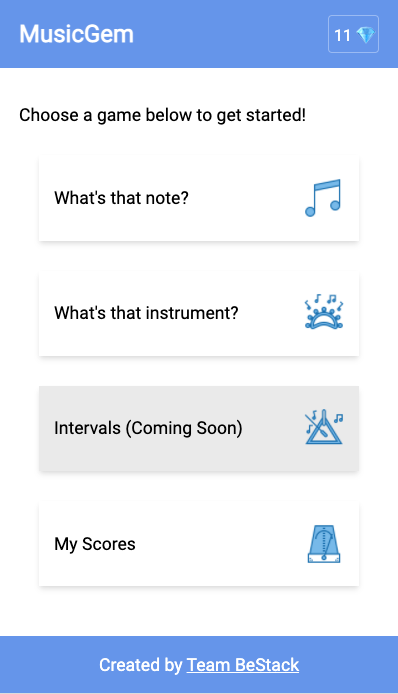

# MusicGem

MusicGem is a mobile web application that allows students to practice basic theory principles such as note and sound recognition. 
It was developed for the first WildCodeSchool Hackathon in November 2021

## Features
- What's that note? - A note recognition game
- What's that instrument? - An instrument recognition game
- Tracks the users results in the scores page
- Users earn gem for each correct answer

## Team
- Pierre Van Male (https://github.com/vmalep)
- Francis Tatepo (https://github.com/ciscodes)
- Tim Coggins (https://github.com/timcoggins)

## Usage
This app can be downloaded and run locally.
- Clone the repository
- Run npm start to begin using the application